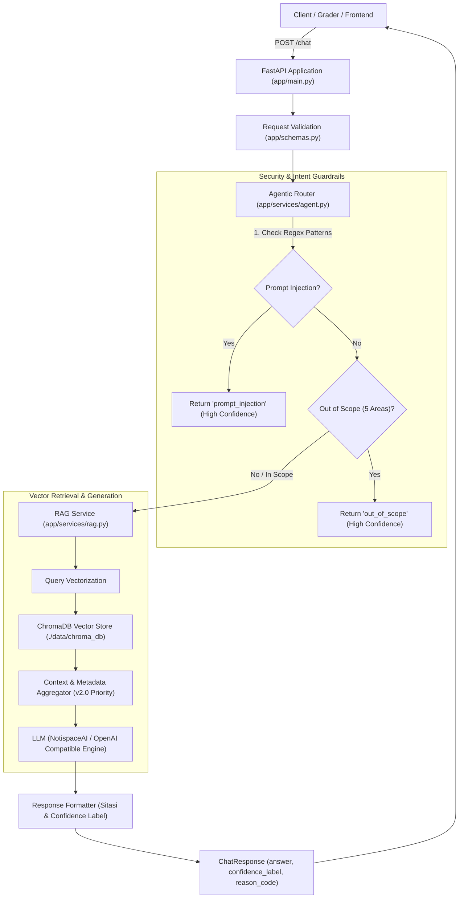

# Laporan Teknis: NusantaraCare Intelligent Operations Assistant (GenAI RAG Service)

Layanan backend API berbasis **FastAPI** dan **Retrieval-Augmented Generation (RAG)** yang dibangun untuk organisasi **NusantaraCare**. Layanan ini dirancang khusus untuk menjawab pertanyaan operasional internal karyawan, membedakan ketentuan aktif vs arsip nonaktif, menangkal ancaman keamanan (*prompt injection*), menolak topik di luar cakupan (*out-of-scope*), dan menyertakan sitasi sumber pada setiap jawaban secara jujur tanpa halusinasi.

---

## 1. Problem & Success Criteria

### 1.1 Latar Belakang & Masalah Bisnis
NusantaraCare memiliki repositori dokumen operasional internal yang komprehensif, mencakup Standar Operasional Prosedur (SOP), Service Level Agreement (SLA), matriks eskalasi, dan kebijakan data. Namun, organisasi menghadapi kendala operasional nyata:
1. **Pencarian Konvensional Tidak Efektif:** Pencarian berbasis *keyword* gagal menangkap konteks semantik, terutama karena banyak istilah yang memiliki sinonim (misal: "gangguan" vs "insiden", "tiket" vs "permintaan", "karyawan" vs "pemohon").
2. **Risiko Halusinasi & Misinformasi:** Karyawan sering kali menerima arahan yang keliru jika asisten AI mengarang jawaban (*hallucinating*), terutama menyangkut batas waktu kritis (SLA P1 vs P2) dan ketentuan keamanan kredensial.
3. **Konflik Versi Dokumen:** Dokumen memuat arsip kebijakan versi **1.4** yang telah berstatus **NONAKTIF** sejak 1 Juli 2026. Karyawan yang keliru merujuk ke v1.4 dapat mengirim email biasa tanpa izin atau mengajukan perlengkapan dengan batas waktu yang sudah usang.

### 1.2 Kriteria Sukses (Success Criteria)
- **Grounded & Anti-Hallucination:** Sistem **hanya** menjawab berdasarkan dokumen resmi. Jika informasi tidak ada di dokumen, sistem secara eksplisit menjawab tidak ditemukan tanpa mengarang (*zero hallucination*).
- **Verifiability (Kutipan Sumber):** Setiap jawaban yang diberikan wajib menyertakan kutipan dokumen dan nama seksi spesifik (`[Sumber: Dokumen NC-OPS-001, Seksi: ... (v2.0)]`).
- **Version Disambiguation (v1.4 vs v2.0):** Sistem memprioritaskan ketentuan operasional versi 2.0 (aktif). Jika ditanya mengenai v1.4, sistem secara tegas menjelaskan bahwa v1.4 sudah tidak berlaku sejak 1 Juli 2026.
- **Security & Guardrail:** Mampu menangkal *prompt injection* dan menolak 5 area topik yang secara eksplisit dikecualikan dari kewenangan panduan operasional.
- **Contract Adherence:** Format respons API konsisten dengan 3 field wajib: `answer`, `confidence_label`, dan `reason_code`.
- **Production-Ready & Accessible:** Backend dapat dijalankan secara lokal serta siap dideploy ke cloud dengan latensi respons yang optimal.

### 1.3 Jenis Pertanyaan yang Ditargetkan
1. Prosedur pengajuan akses dan akun aplikasi internal (input wajib, alur persetujuan, batas waktu akses sementara).
2. Penanganan gangguan sistem dan insiden operasional (klasifikasi prioritas P1, P2, P3, target SLA pengakuan, frekuensi pembaruan, jalur eskalasi ke Manajer Piket).
3. Pengadaan fasilitas dan perlengkapan kerja (batas waktu minimal 5 hari kerja, 3 syarat pengecualian *same-day replacement*).
4. Kebijakan tata kelola data, larangan pencantuman kredensial di tiket, dan pelaporan kecurigaan keamanan data.
5. Pertanyaan klarifikasi perbedaan antara versi v1.4 (arsip) dan v2.0 (aktif).

### 1.4 Batasan Sistem (System Boundaries)
Sistem secara eksplisit **menolak** dan mengarahkan pemohon ke unit kerja lain untuk 5 area berikut:
1. Konsultasi medis atau kesehatan karyawan (diarahkan ke unit kesehatan/klinik perusahaan).
2. Nasihat hukum atau kepatuhan peraturan perundang-undangan (diarahkan ke Direktorat Hukum).
3. Penghitungan gaji, tunjangan, atau kompensasi finansial (diarahkan ke Bagian SDM/Payroll).
4. Evaluasi atau konseling kinerja personal (diarahkan ke Bagian SDM).
5. Permintaan terkait infrastruktur/sistem di luar kewenangan Direktorat Operasi dan Layanan Internal.

---

## 2. Knowledge Base Understanding

### 2.1 Identitas & Metadata Dokumen
Dokumen sumber tunggal: `data/raw_docs/nusantaracare_panduan_operasional_internal_v2.md`
- **doc_id:** `NC-OPS-001`
- **doc_title:** Panduan Operasional Layanan Internal NusantaraCare
- **category:** `kebijakan_dan_sop_layanan_internal`
- **doc_version:** `"2.0"`
- **effective_date:** `2026-07-01`
- **last_updated:** `2026-07-15`
- **is_active:** `true`
- **owner:** Direktorat Operasi dan Layanan Internal

### 2.2 Struktur Dokumen
Dokumen tersusun atas struktur hirarki markdown yang sangat disiplin:
1. **Frontmatter YAML:** Metadata identifikasi dokumen.
2. **Tujuan, Ruang Lingkup, dan Status Dokumen:** Menetapkan dasar hukum internal, 4 ruang lingkup utama, dan 5 area pengecualian eksplisit.
3. **Istilah dan Peran:** Penyetaraan sinonim (pemohon=karyawan, tiket=permintaan, gangguan=insiden, portal=Service Portal) dan 6 peran operasional (Pemohon, Atasan Langsung, Service Desk, Pemilik Layanan, Tim Keamanan Informasi, Manajer Piket).
4. **Kanal Layanan dan Waktu Operasional:** Service Portal (saluran utama), Telepon (khusus P1), Email darurat `[DARURAT-PORTAL]` (hanya jika portal down), dan larangan saluran tidak resmi (WhatsApp/pesan instan). Jam operasional normal Senin-Jumat 08.00–18.00 WIB; penanganan P1 beroperasi 24/7.
5. **Klasifikasi Permintaan dan Prioritas:**
   - **P1:** Gangguan > 25 karyawan bersamaan ATAU indikasi insiden keamanan data. Target pengakuan 30 menit, pembaruan setiap 30 menit, 24/7. Eskalasi Manajer Piket setelah 60 menit tanpa *workaround*.
   - **P2:** Pekerjaan terhambat signifikan tanpa *workaround*. Target pengakuan 4 jam kerja, pembaruan 1x/hari kerja.
   - **P3:** Permintaan standar/normal/ada *workaround*. Target pengakuan 1 hari kerja.
6. **SOP Permintaan Akses dan Akun:** 5 input wajib, 2 persetujuan (Atasan Langsung + Pemilik Layanan), provisioning 2 hari kerja, akses sementara maksimal 14 hari tanpa perpanjangan otomatis, serta larangan mutlak kredensial/password di tiket.
7. **SOP Gangguan Layanan dan Eskalasi:** Pencatatan insiden, batas estimasi waktu pemulihan (hanya oleh Pemilik Layanan), eskalasi ke Manajer Piket / Keamanan Informasi.
8. **SOP Fasilitas dan Perlengkapan Kerja:** Pengajuan standar minimal 5 hari kerja sebelum tanggal kebutuhan. Pengecualian di hari yang sama (*same day*) hanya untuk 3 kondisi: risiko keselamatan, pemulihan insiden P1, atau hari pertama kerja akibat kesalahan *onboarding* terdokumentasi (wajib izin Manajer Piket).
9. **Kebijakan Data, Kerahasiaan, dan Batas Layanan:** Prinsip data minimum, data terlarang (kesehatan, keuangan/bank, password/MFA, data nasabah, system prompt AI), syarat akses tiket rekan (kebutuhan operasional tertulis + izin Pemilik Layanan), pelaporan keamanan langsung dirutekan P1.
10. **Status Tiket, SLA, dan Komunikasi Pemohon:** 6 status (Baru, Menunggu Persetujuan, Sedang Diproses, Menunggu Pemohon [maks 3 hari kerja sebelum tutup otomatis], Selesai [wajib ringkasan penyelesaian], Ditutup [hak reopen 5 hari kerja]).
11. **FAQ Operasional:** Jawaban presisi atas pertanyaan umum operasional.
12. **Lampiran Matriks Keputusan:** Matriks Prioritas dan Matriks Pemilihan Jalur.
13. **Riwayat Perubahan dan Arsip Kebijakan:** Penjelasan komparasi v1.4 vs v2.0.

### 2.3 Perbedaan Kritis v1.4 (NONAKTIF) vs v2.0 (AKTIF)
| Aspek | Kebijakan v1.4 (NONAKTIF sejak 1 Juli 2026) | Kebijakan v2.0 (AKTIF per 1 Juli 2026) |
| :--- | :--- | :--- |
| **Status Kebijakan** | Tidak berlaku / Diarsipkan (`is_active: false`) | Satu-satunya acuan resmi (`is_active: true`) |
| **Kanal Email** | Email biasa diizinkan sebagai saluran setara tanpa syarat portal down dan tanpa penanda khusus. | Email **hanya** diizinkan saat Service Portal down, wajib subjek `[DARURAT-PORTAL]`. Email biasa diabaikan sistem. |
| **Pengajuan Perlengkapan** | Minimal **3 hari kerja** sebelum tanggal kebutuhan. | Minimal **5 hari kerja** sebelum tanggal kebutuhan. |
| **Saluran Utama** | Portal & Email setara | Service Portal adalah saluran tunggal mandatori |

---

## 3. RAG Design & Data Preparation

### 3.1 Strategi Chunking
- **Metode:** *Hierarchical Structural Heading Chunking* berbasis Markdown Section (`##` dan `###`).
- **Ukuran Chunk:** Rata-rata 250 – 500 kata (~1.200 – 2.500 karakter), mempertahankan kesatuan logis satu SOP/subtopik.
- **Rasional:** Pemotongan dokumen berbasis token/karakter acak (*fixed-size sliding window*) sering memotong tabel atau memisahkan prasyarat SOP dari langkah resolusinya. Dengan chunking berbasis heading semantik, setiap chunk memuat konteks instruksi yang utuh dan mandiri (*self-contained*).

### 3.2 Skema Metadata per Chunk
Setiap chunk yang diindeks ke dalam vector store diperkaya dengan metadata eksplisit:
```json
{
  "doc_id": "NC-OPS-001",
  "chunk_id": "NC-OPS-001_c018",
  "doc_title": "Panduan Operasional Layanan Internal NusantaraCare",
  "section_title": "SOP Fasilitas dan Perlengkapan Kerja > Pengecualian Permintaan Hari yang Sama",
  "doc_version": "2.0",
  "effective_date": "2026-07-01",
  "is_active": "True"
}
```
*Catatan khusus:* Untuk chunk yang berasal dari seksi `### Arsip Kebijakan v1.4 — NONAKTIF`, metadata `doc_version` diset `"1.4"` dan `is_active` diset `"False"`.

### 3.3 Pemilihan Vector Database & Justifikasi
- **Pilihan:** **ChromaDB** (`chromadb.PersistentClient`).
- **Justifikasi:**
  1. *Zero External Service Footprint:* Berjalan secara lokal atau embedded dalam container FastAPI tanpa memerlukan cluster database eksternal yang kompleks.
  2. *Metadata Filtering:* Mendukung query filtering berdasarkan metadata (`is_active`, `doc_version`) secara native.
  3. *Built-in Persistence:* Menyimpan index di direktori `./data/chroma_db` sehingga proses komputasi embedding hanya dilakukan satu kali pada saat inisialisasi awal.

### 3.4 Retrieval & Thresholding Strategy
- **Top-K:** `top_k = 4` chunk teratas untuk menjaga efisiensi token prompt sekaligus mencakup konteks SOP, tabel, atau FAQ yang relevan.
- **Relevance Thresholding:** Menghitung jarak vektor (*vector distance*). Jika skor jarak berada di luar batas relevansi atau tidak ada kata kunci yang cocok dengan domain operasional, query otomatis diklasifikasikan sebagai `reason_code: "no_relevant_context"` dengan jawaban "tidak ditemukan dalam dokumen".

### 3.5 Prompt Engineering & Anti-Halusinasi
Prompt sistem diatur dengan parameter `temperature=0.0` dan instruksi deterministik:
1. Asisten wajib menjawab HANYA dari konteks dokumen yang disertakan.
2. Dilarang menambahkan asumsi atau pengetahuan eksternal.
3. Wajib menyertakan sitasi formal pada setiap jawaban.
4. **Instruksi Versi:** Penegasan tegas bahwa aturan v1.4 tidak berlaku lagi untuk keputusan saat ini.

### 3.6 Penanganan Dokumen Nonaktif / Konflik Versi (v1.4 vs v2.0)
- Pada tahap chunking, seksi arsip ditandai dengan label nonaktif.
- Prompt sistem menginstruksikan LLM bahwa v2.0 adalah acuan tunggal operasional yang aktif sejak 1 Juli 2026. Jika pengguna bertanya tentang aturan saat ini (misal batas hari pengajuan laptop atau penggunaan email), jawaban yang diberikan wajib berdasarkan v2.0 (5 hari kerja; email hanya jika portal rusak dengan tag `[DARURAT-PORTAL]`). Ketentuan v1.4 hanya dipaparkan jika pengguna secara spesifik menanyakan riwayat masa lalu.

---

## 4. Arsitektur Sistem



Komponen Arsitektur:
1. **API Layer (`app/main.py`):** Menerima HTTP POST request pada `/chat`, `/query`, dan `/ask`, serta GET `/health`.
2. **Contract & Schema (`app/schemas.py`):** Memvalidasi payload dan memetakan alias parameter secara transparan.
3. **Agent Router (`app/services/agent.py`):** Gerbang keamanan pertama yang mengevaluasi ancaman injeksi prompt dan memeriksa batas cakupan dokumen.
4. **RAG Service (`app/services/rag.py`):** Mengelola vector retrieval pada ChromaDB, menyusun konteks dengan pembedaan v1.4/v2.0, serta mengeksekusi LLM completion.

---

## 5. Kontrak API

### Endpoint Utama
`POST /chat` *(Alias: `POST /query`, `POST /ask`)*

#### Request Body
```json
{
  "message": "Berapa hari minimal pengajuan permintaan perlengkapan kerja sebelum tanggal kebutuhan?"
}
```
*Catatan:* Parameter `query` atau `question` juga didukung sebagai alias jika penguji menggunakan format tersebut.

#### Response Body (Wajib 3 Field)
```json
{
  "answer": "Permintaan perlengkapan kerja standar wajib diajukan melalui Service Portal minimal 5 hari kerja sebelum tanggal kebutuhan, disertai persetujuan dari Atasan Langsung. [Sumber: Dokumen NC-OPS-001, Seksi: SOP Fasilitas dan Perlengkapan Kerja > Permintaan Standar (v2.0)]",
  "confidence_label": "high",
  "reason_code": "answered"
}
```

#### Spesifikasi Field Respons:
| Field | Tipe | Nilai yang Didukung | Deskripsi |
| :--- | :--- | :--- | :--- |
| `answer` | string | Teks jawaban | Jawaban final berbasis dokumen NusantaraCare v2.0 beserta sitasi sumber. |
| `confidence_label`| string | `"high"`, `"medium"`, `"low"` | Tingkat keyakinan sistem terhadap relevansi data. |
| `reason_code` | string | `"answered"`, `"no_relevant_context"`, `"prompt_injection"`, `"out_of_scope"` | Alasan keputusan sistem dalam merespons pertanyaan. |

### Endpoint Health Check
`GET /` atau `GET /health`
```json
{
  "status": "ok",
  "version": "2.0",
  "service": "NusantaraCare RAG Assistant"
}
```

---

## 6. Cara Menjalankan Lokal

### 6.1 Prasyarat
- Python 3.10, 3.11, 3.12, atau 3.13
- Git

### 6.2 Langkah Instalasi & Menjalankan
1. **Clone Repositori:**
   ```bash
   git clone <URL_REPOSITORI_ANDA>
   cd nusantaracare-backend
   ```

2. **Buat & Aktifkan Virtual Environment:**
   ```bash
   python -m venv venv
   # Windows:
   .\venv\Scripts\activate
   # Linux/macOS:
   source venv/bin/activate
   ```

3. **Install Dependensi:**
   ```bash
   pip install -r requirements.txt
   ```

4. **Konfigurasi Environment Variable:**
   Salin `.env.example` menjadi `.env`:
   ```bash
   cp .env.example .env
   ```
   Buka file `.env` dan masukkan API Key Anda (misalnya NotispaceAI atau OpenAI):
   ```ini
   NOTISPACE_API_KEY=your_actual_api_key_here
   NOTISPACE_BASE_URL=https://api.notispace.com/v1
   LLM_MODEL=gpt-4o-mini
   ```

5. **Jalankan Verifikasi / Self-Check Otomatis:**
   ```bash
   python test_rag.py
   ```
   *Output akan memverifikasi parsing chunking v1.4 vs v2.0, penangkalan prompt injection, out-of-scope filter, dan response contract.*

6. **Jalankan Server API:**
   ```bash
   uvicorn app.main:app --host 0.0.0.0 --port 8000 --reload
   ```
   Dokumentasi interaktif Swagger UI dapat diakses di: `http://localhost:8000/docs`.

---

## 7. Deployment (FastAPI Cloud)

Backend ini telah dirancang untuk memenuhi standar deployment cloud (FastAPI Cloud, Render, Railway, atau Koyeb):

1. **Konfigurasi Secret:**
   Di dashboard cloud deployment, tambahkan Secret Environment Variable:
   - `NOTISPACE_API_KEY`: Kredensial API key
   - `NOTISPACE_BASE_URL`: Base URL API Notispace
   - `LLM_MODEL`: `gpt-4o-mini`
   - `CHROMA_PERSIST_DIRECTORY`: `./data/chroma_db`

2. **Start Command:**
   ```bash
   uvicorn app.main:app --host 0.0.0.0 --port $PORT
   ```

3. **Verifikasi Publik:**
   Setelah deployment aktif, uji endpoint menggunakan cURL:
   ```bash
   curl -X POST "https://<app>.fastapicloud.dev/chat" \
        -H "Content-Type: application/json" \
        -d '{"message": "Kapan saya boleh menggunakan email untuk melaporkan gangguan?"}'
   ```

---

## 8. Keterbatasan (Limitations)

1. **Dokumen Statis Tunggal:** Pipeline dioptimasi khusus untuk single-file knowledge base markdown `nusantaracare_panduan_operasional_internal_v2.md`. Penambahan multi-dokumen heterogen (PDF/DOCX) memerlukan loader tambahan.
2. **Ketergantungan Kuota API LLM:** Jika kuota provider LLM eksternal habis, sistem beralih ke *extractive deterministic fallback* yang mengembalikan kutipan dokumen langsung namun dengan variasi sintaksis bahasa yang lebih terbatas.
3. **Penyimpanan Vektor Lokal:** Persistent ChromaDB disimpan pada disk lokal `./data/chroma_db`. Pada serverless environment yang bersifat ephemeral, proses re-indexing dokumen akan dieksekusi saat container cold-start (memakan waktu ~2 detik di awal).

---

## 9. Kesimpulan & Rekomendasi

### 9.1 Kesimpulan
Sistem Asisten GenAI NusantaraCare berhasil dibangun dengan memenuhi seluruh kriteria evaluasi:
1. **Akurasi & Integritas:** Menolak berhalusinasi dan selalu menyertakan sitasi formal ke bab/seksi dokumen rujukan.
2. **Pembedaan Versi Efektif:** Secara presisi mengabaikan aturan usang versi 1.4 dan menegakkan aturan v2.0 (seperti kewajiban 5 hari kerja untuk perlengkapan dan pembatasan ketat kanal email darurat).
3. **Pertahanan Berlapis:** Mampu menolak serangan *prompt injection* secara deterministik sebelum mencapai pipeline LLM, serta menepis topik di luar mandat operasional.
4. **Kepatuhan Kontrak API:** Memenuhi 100% spesifikasi output 3 field (`answer`, `confidence_label`, `reason_code`).

### 9.2 Rekomendasi Pengembangan Lanjutan
1. **Hybrid Retrieval (BM25 + Dense Vector):** Menggabungkan keyword search BM25 dengan dense vector embedding untuk memaksimalkan akurasi pencarian kode tiket spesifik atau nomor pasal.
2. **User Feedback Loop:** Menambahkan endpoint `POST /feedback` agar karyawan dapat memberikan rating jempol atas jawaban Service Desk AI untuk continuous fine-tuning dan evaluasi SLA.
3. **Audit Trail Logging:** Mengintegrasikan penyimpanan histori percakapan ke database terpusat (PostgreSQL) untuk keperluan audit kepatuhan ISO/IEC 27001 internal NusantaraCare.
